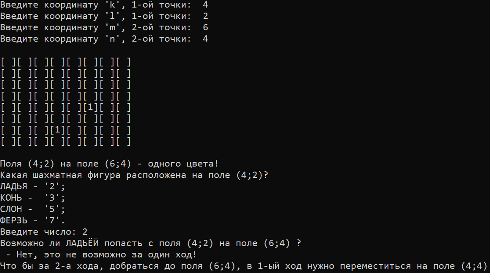
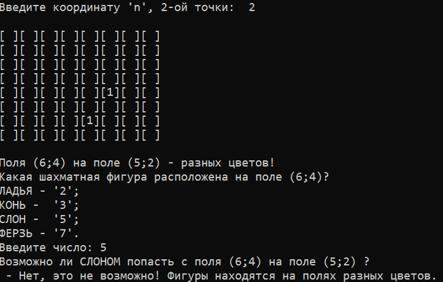

## ЛАБОРАТОРНЫЕ РАБОТЫ №8 и №9
#  Шахматы и логирование
# Постановка задачи:
## Поле шахматной доски определяется парой натуральных чисел, каждое из которых не превосходит восьми: первое число — номер вертикали (при счете слева направо), второе — номер горизонтали (при счете снизу вверх).
## Даны натуральные числа k, l, m, n, каждое из которых не превосходит восьми.
# Требуется:
## а) Выяснить, являются ли поля (k, I) и (m, n) полями одного цвета.
## 6) На поле (к, I) расположен ферзь, ладья, слон или конь (должен ввести пользователь). Угрожает ли он полю (m, n)?
## в) Выяснить, можно ли с поля (k, I) одним ходом ладьи, ферзя или слона (должен ввести пользователь) попасть на поле (m, n). Если нет, то выяснить, как это можно сделать за два хода (указать поле, на которое приводит первый ход).

#Лабораторная работа № 9 - логирование. Результаты в текстовом документе - log.txt
### Открыть проект можно с помощью среды программирования Visual Studio 2019. Для запуска следует открывать папку проекта под названием "Lab8".
